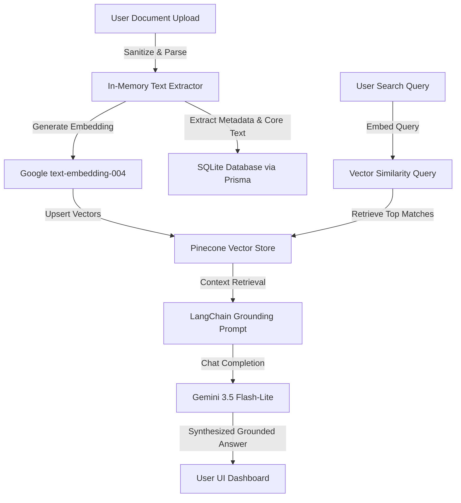

# 🔱 INDRA AI — Institutional Knowledge Intelligence

> **Empowering Enterprise Decision-Making via Grounded RAG, Named Entity Recognition, and Trust-Scored Institutional Memory.**

[](https://indra-ai-13ede.web.app)
[](https://ai.google.dev/)
[](https://trpc.io)
[](https://js.langchain.com/)

---

## 💡 The Vision & The Problem
In modern organizations, critical institutional knowledge is scattered across static PDFs, email threads, chat history, and disconnected wikis. New hires face steep learning curves, while veteran teams lose time hunting for historical context. 

**INDRA AI** solves this by acting as an **Autonomous Institutional Memory**. It doesn't just store documents—it ingests, sanitizes, summarizes, and extracts relationships (Knowledge Graph) to build an interactive, searchable network of corporate intelligence.

---

## 🔥 Key Features

### 🧠 1. Grounded RAG Pipeline (Gemini 3.5 & LangChain)
* **Retrieval-Augmented Generation**: Answers user queries strictly grounded in retrieved documents.
* **Context Grounding**: Limits LLM response parameters to prevent creative fabrication.
* **Citation System**: Automatically references ingested sources (`[1]`, `[2]`, etc.) directly in answers.

### 🕸️ 2. Automated Knowledge Graphs & NER
* **Named Entity Recognition (NER)**: Automatically extracts key entities (`person`, `topic`, `project`, `team`) during document ingestion.
* **Network Visualizations**: Maps connections between people, projects, and documents to identify domain experts and reference materials.

### 🛡️ 3. Prompt Injection Defense & Hallucination Guard
* **Input Sanitization**: Detects and intercepts jailbreaks, system-prompt override attempts, and HTML script tags.
* **Hallucination Prevention**: Automatically scores retrieved source confidence to flag or escalate low-accuracy responses before they reach the user.

### ⚡ 4. AI-Powered Auto-Summarization
* **Executive Summary Generator**: Generates concise, structured summaries of uploaded documentation.
* **Custom Styles**: Tailor summaries to specific lengths or formats (e.g., standard, bulleted list, technical guide).

---

## 🏗️ Architecture & Flow



---

## 🛠️ Tech Stack
* **Monorepo Architecture**: Managed via **Turborepo** & **pnpm**.
* **Frontend**: **Vite SPA** (React, TailwindCSS, glassmorphic dark UI, Mermaid visualizations).
* **Backend**: **Express** + **tRPC** (Type-safe end-to-end API communication).
* **AI & LLM**: **LangChain** (`@langchain/google-genai`), **Google Gemini 3.5 Flash-Lite**, and **text-embedding-004**.
* **Vector DB**: **Pinecone Vector Database** (with a graceful in-memory mock store for developer convenience).
* **Database**: **SQLite** (local development) with **Prisma ORM**.
* **Deployment**: Hosted on **Firebase Hosting** + secure Firebase Auth configuration.

---

## 🚀 Getting Started

### 📋 Prerequisites
* [Node.js v18+](https://nodejs.org)
* [pnpm](https://pnpm.io)

### ⚙️ Environment Configuration
1. Navigate to `apps/api/`
2. Duplicate `.env.example` as `.env`
3. Configure your API credentials:
```env
# App Configuration
PORT=3000
API_BASE_URL=http://localhost:3000
CORS_ORIGINS=http://localhost:5173

# Gemini API
GEMINI_API_KEY=your_gemini_api_key_here
COMPLETION_MODEL=gemini-3.5-flash-lite
EMBEDDING_MODEL=text-embedding-004

# Pinecone (Optional, falls back to Mock store)
PINECONE_API_KEY=your_pinecone_key
PINECONE_INDEX_NAME=indra-ai-prod
```

### 💻 Local Run Commands

1. **Install Dependencies**:
   ```bash
   pnpm install
   ```

2. **Initialize Database & Seed Schema**:
   ```bash
   npx prisma db push --schema=apps/api/prisma/schema.prisma
   ```

3. **Run Dev Servers (Frontend + Backend)**:
   ```bash
   pnpm dev
   ```
   * Frontend: `http://localhost:5173`
   * Backend API: `http://localhost:3000`

4. **Production Build**:
   ```bash
   pnpm build
   ```