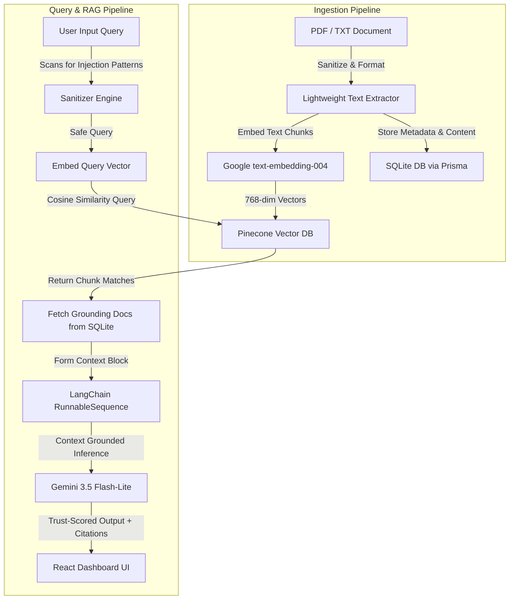

# 🔱 INDRA AI — Institutional Knowledge Intelligence

> **An Enterprise-Grade, Trust-Scored Institutional Memory Platform Powered by Grounded RAG, Named Entity Recognition, and Dynamic Knowledge Graphs.**

[](https://indra-ai-13ede.web.app)
[](https://ai.google.dev/)
[](https://trpc.io)
[](https://js.langchain.com/)

🔗 **Project Links:**
* **Live Demo Application**: [https://indra-ai-13ede.web.app](https://indra-ai-13ede.web.app)
* **GitHub Code Repository**: [https://github.com/TechOrbiters/INDRA-AI](https://github.com/TechOrbiters/INDRA-AI)

---

## 💡 Table of Contents
1. [The Vision & Pain Points](#-the-vision--pain-points)
2. [Platform Core Modules](#-platform-core-modules)
3. [System Architecture & Data Flow](#-system-architecture--data-flow)
4. [Monorepo Directory Layout](#-monorepo-directory-layout)
5. [tRPC API Reference](#-trpc-api-reference)
6. [Tech Stack Details](#-tech-stack-details)
7. [Installation & Local Setup](#-installation--local-setup)
8. [Troubleshooting & Verification](#-troubleshooting--verification)
9. [Roadmap & Scale Strategy](#-roadmap--scale-strategy)

---

## 💡 The Vision & Pain Points

In modern enterprises, critical domain knowledge is scattered across fragmented channels: disconnected Slack threads, outdated Wikis, localized PDFs, and email chains. This creates **three structural problems**:
* **The Onboarding Churn**: New hires waste hours searching for historical context or asking repetitive questions to senior engineers.
* **Information Decay**: Wiki articles rot over time, and team members can't distinguish between outdated docs and current ground-truth.
* **Lack of Trust in AI**: Generative AI tools hallucinate, inventing procedures or facts because they lack real-time context grounding and security defenses.

**INDRA AI** functions as an **Autonomous Institutional Memory**. It automatically ingests static documents, extracts named entities to form a living **Knowledge Graph**, summarizes long texts, sanitizes inputs from prompt injections, and delivers grounded, trust-scored answers backed by strict source citations.

---

## 🛡️ Platform Core Modules

### 🧠 1. Grounded RAG Pipeline (Gemini 3.5 & LangChain)
The search interface does not perform generic chat completions. Instead, it utilizes an isolated, context-bounded Retrieval-Augmented Generation pipeline:
* **Strict Context Constraint**: Gemini is explicitly instructed via system prompting to only answer based on the retrieved documents. If the query isn't answered in the context, it gracefully escalates instead of fabricating information.
* **Citation Generation**: The pipeline references sources using `[1]`, `[2]`, etc., allowing users to hover and inspect the origin of every factual claim.
* **Temperature Tuning**: Hardcoded to `0.1` for factual correctness, eliminating creative variance.

### 🕸️ 2. Named Entity Recognition (NER) & Knowledge Graph Mapping
During document ingestion, INDRA AI parses text and streams it to a dedicated entity extractor:
* **Automated Tagging**: Extracts entities corresponding to **people**, **topics**, **projects**, and **teams**.
* **Visual Graph Rendering**: Uses dynamic visual mapping on the client to render networks showing how knowledge entries relate to active projects, team members, and departments.

### 🛡️ 3. Prompt Injection Defense & Sanitization
To protect enterprise information security, all user inputs are sanitized before being processed by the vector store or the LLM:
* **Attack Detection**: Scans for regular expressions matching popular injection techniques (`ignore previous instructions`, `you are now`, `jailbreak`, etc.).
* **HTML/Script Removal**: Strips any HTML tags or script injection strings.
* **Token/Length Control**: Truncates inputs to `2,000` characters to prevent buffer and system-prompt overflow attacks.

### 📊 4. Trust-Scoring & Hallucination Guard
Every search query yields a trust score indicating source confidence:
* **Score Evaluation**: 
  * `Score >= 72%`: High confidence, delivered with a green badge.
  * `50% <= Score < 72%`: Medium confidence, delivered with a yellow warning flag.
  * `Score < 50%`: Low confidence; the interface recommends escalating to a human domain expert.
* **Grounding Document Ordering**: Documents are retrieved based on Pinecone cosine similarity and ordered inside the DB by their past confidence history.

---

## 🏗️ System Architecture & Data Flow



---

## 📁 Monorepo Directory Layout

INDRA AI is structured as a **Turborepo monorepo** to isolate concern and share type declarations seamlessly between the API and Client:

```
├── apps
│   ├── api                   # Express backend API server
│   │   ├── prisma            # SQLite Database schema and migrations
│   │   ├── src
│   │   │   ├── routers       # tRPC router endpoints (auth, knowledge, graph, ai)
│   │   │   ├── services      # Core logic (AI, vector storage, db client)
│   │   │   └── server.ts     # Server entry point (port 3000)
│   │   └── tsconfig.json
│   └── web                   # Vite SPA Frontend Client
│       ├── src
│       │   ├── components    # Shared UI parts (AppShell, SearchBar)
│       │   ├── context       # AuthContext handling auth tokens
│       │   ├── pages         # UI Views (collections, search, experts, admin)
│       │   └── main.tsx      # React entry point (port 5173)
│       └── vite.config.ts
├── packages                  # Shared configuration files
│   ├── eslint-config         # Eslint configuration rules
│   ├── shared                # Zod schemas, interfaces, shared types
│   └── typescript-config     # Shared base TSConfig options
├── package.json
└── turbo.json                # Turborepo task pipeline config
```

---

## 🔌 tRPC API Reference

The backend communicates with the frontend client using a type-safe tRPC schema. Key endpoints include:

### `auth` Router
* `signup`: Register a new organization and default user. Initiates the default workspace and automatically provisions a "General Wiki" collection space.
* `login`: Sign-in user and issues JWT.
* `getCurrentUser`: Retrieve profile, role, and organization data.

### `knowledge` Router
* `listCollections`: Fetch collections within the user's organization. Features *on-the-fly auto-seeding* to guarantee collections are always populated.
* `createEntry`: Insert a new knowledge article, parse tags, and enqueue vector embeddings.
* `parseUploadedFile`: Accept file buffers (PDF/TXT), perform text extraction, and return clean content for user inspection prior to storage.

### `ai` Router
* `synthesizeAnswer`: Accepts search query and collection filters, retrieves grounding documents, synthesizes a cited response using Gemini, and computes the trust score.
* `generateSummary`: Produces an AI summary matching style and length instructions.
* `extractEntities`: Runs entity extraction (NER) over a raw body of text.

---

## 🛠️ Tech Stack Details

* **Runtime & Package Manager**: Node.js & **pnpm** workspaces.
* **Monorepo Build**: **Turborepo** for caching and orchestration.
* **API Layer**: **tRPC** for end-to-end type safety, eliminating REST boilerplate.
* **AI Orchestration**: **LangChain** (`@langchain/core` and `@langchain/google-genai`).
* **AI Models**:
  * Completion: **Google Gemini 3.5 Flash-Lite** (`gemini-3.5-flash-lite`).
  * Embedding: **Google text-embedding-004** (`text-embedding-004`, 768 dimensions).
* **Database & ORM**: **Prisma** with **SQLite** for zero-setup local storage.
* **Vector Index**: **Pinecone REST API** client (with in-memory mock store fallback).
* **Deployment & Auth**: **Firebase Hosting** + **Firebase Auth** integrations.

---

## 🚀 Installation & Local Setup

### 1. Clone the repository and install packages
Ensure you use `pnpm` to resolve workspace symlinks correctly:
```bash
git clone https://github.com/TechOrbiters/INDRA-AI.git
cd INDRA-AI
pnpm install
```

### 2. Configure Environment variables
Navigate to the API folder and create a `.env` file:
```bash
cd apps/api
cp .env.example .env
```
Fill out the keys:
```env
PORT=3000
API_BASE_URL=http://localhost:3000
CORS_ORIGINS=http://localhost:5173

# Gemini Keys
GEMINI_API_KEY=your-gemini-developer-key
COMPLETION_MODEL=gemini-3.5-flash-lite
EMBEDDING_MODEL=text-embedding-004

# Vector DB settings (Omit/leave blank to use the in-memory mock vector store)
PINECONE_API_KEY=
PINECONE_INDEX_NAME=
PINECONE_ENVIRONMENT=
```

### 3. Initialize Database Schema
Push the Prisma schemas to SQLite:
```bash
npx prisma db push --schema=prisma/schema.prisma
```

### 4. Run Development Servers
Navigate back to the project root and launch the Turborepo dev servers:
```bash
cd ../../
pnpm dev
```
* **Frontend UI**: `http://localhost:5173`
* **Backend API**: `http://localhost:3000`

---

## 🔍 Troubleshooting & Verification

### Prisma Schema Changes
If you modify `apps/api/prisma/schema.prisma`, regenerate client definitions:
```bash
npx prisma generate --schema=apps/api/prisma/schema.prisma
```

### Testing the Ingestion Pipe locally
You can verify the backend compiles clean by building:
```bash
pnpm build
```

---

## 🗺️ Roadmap & Scale Strategy

* **Multi-Modal Document Parsing**: Support for ingestion of flowcharts, database diagrams, and images using Gemini multimodal features.
* **Enterprise Identity Integrations**: Standard SAML / Okta SSO authentication pipelines.
* **Slack & Google Drive Connectors**: Active background synchronization agents to sync Confluence spaces, Slack channels, and Google Drive folders into Pinecone automatically.